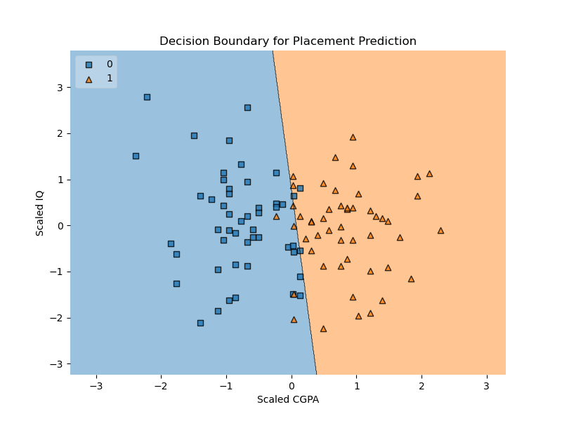

# Placement Predictor ML App

An end-to-end Machine Learning project that predicts whether a student will get placed based on **CGPA** and **IQ**.

The project demonstrates the **complete ML lifecycle**, including data cleaning, exploratory data analysis, model training, inference pipeline creation, API development, and deployment.


---

## Live Demo

Web App:
`https://placement-predictor-ml.onrender.com`

API Endpoint:
`POST /api/predict`

Example API Request:

```
POST /api/predict
Content-Type: application/json

{
  "cgpa": 8.2,
  "iq": 120
}
```

Example Response:

```
{
  "prediction": "Placement Likely",
  "probability": 99.83
}
```

---

# Project Overview

This project predicts student placement outcomes using a **Logistic Regression model** trained on CGPA and IQ.

The application includes:

• Data preprocessing pipeline
• Model training and evaluation
• Model serialization
• Flask web interface
• REST API for predictions
• Automated API testing

The goal is to demonstrate how a **machine learning model can be converted into a production-style inference service**.

---

# Dataset

The dataset contains three columns:

| Feature   | Description                                  |
| --------- | -------------------------------------------- |
| cgpa      | Student CGPA                                 |
| iq        | Intelligence score                           |
| placement | Target variable (1 = placed, 0 = not placed) |

Example data:

```
cgpa   iq    placement
6.8    123   Yes
5.9    106   No
7.4    132   Yes
```

---

# Data Cleaning

Several preprocessing steps were applied:

### 1. Decimal Format Conversion

CGPA values were stored using commas.

```
6,8 → 6.8
```

Converted using:

```
str.replace(",", ".")
astype(float)
```

---

### 2. Missing Value Handling

Missing CGPA values were replaced using **mean imputation**.

```
df["cgpa"].fillna(df["cgpa"].mean())
```

---

### 3. Label Encoding

```
Yes → 1
No → 0
```

Final dataset types:

```
cgpa        float
iq          float
placement   int
```

---

# Exploratory Data Analysis

## Scatter Plot

CGPA vs IQ colored by placement outcome.

Observation:

• Higher CGPA strongly correlates with placement
• IQ has weaker predictive power

---

## Correlation Analysis

| Feature | Correlation with Placement |
| ------- | -------------------------- |
| CGPA    | ~0.80                      |
| IQ      | ~-0.08                     |

Conclusion:

**CGPA is the dominant predictor.**

---

# Feature Preparation

Input Features:

```
X = [cgpa, iq]
```

Target:

```
y = placement
```

---

# Model Training

Model used:

```
Logistic Regression
```

Steps:

1. Train-test split

```
test_size = 0.1
random_state = 42
```

2. Feature scaling using StandardScaler

3. Model training

```
model.fit(X_train, y_train)
```

---

# Model Performance

Accuracy:

```
~80%
```

Model coefficients:

```
CGPA weight ≈ 3.29
IQ weight ≈ 0.32
```

Interpretation:

CGPA has significantly stronger influence on placement prediction.

---

# Decision Boundary Visualization

The logistic regression decision boundary was visualized using:

```
mlxtend.plotting.plot_decision_regions
```

This helps illustrate how the model separates:

```
Placed vs Not Placed
```

in feature space.



---

# Project Structure

```
placement-ml-project
│
├── app
│   ├── app.py
│   ├── test_api.py
│   └── templates
│       └── index.html
│
├── src
│   └── predict.py
│
├── models
│   ├── model.pkl
│   └── scaler.pkl
│
├── notebooks
│   └── placement_data_analysis.ipynb
│
├── data
│   ├── original_placement_data.csv
│   └── cleaned_placement_data.csv
│
├── requirements.txt
└── README.md
```

---

# Running the Project Locally

## 1. Clone Repository

```
git clone https://github.com/anshid/placement-predictor-ml.git
cd placement-predictor-ml
```

---

## 2. Install Dependencies

```
pip install -r requirements.txt
```

---

## 3. Start Flask Server

```
python app/app.py
```

Open:

```
http://127.0.0.1:5000
```

---

# API Usage

Endpoint:

```
POST /api/predict
```

Request Body:

```
{
  "cgpa": 8.2,
  "iq": 120
}
```

Response:

```
{
  "prediction": "Placement Likely",
  "probability": 99.83
}
```

---

# API Testing

Test using Python:

```
python app/test_api.py
```

---

# Technologies Used

• Python
• Flask
• Scikit-learn
• NumPy
• Pandas
• Bootstrap
• Joblib
• Gunicorn

---

# Future Improvements

Possible extensions:

• Add more predictive features (projects, internships, coding scores)
• Implement batch prediction endpoint
• Add model monitoring
• Add experiment tracking
• Dockerize the application
• CI/CD pipeline for automated deployment

---

# Author

Anshid

Mathematician-turned-ML engineer, translating rigorous mathematical thinking into practical machine learning systems and intelligent software. Interested in building systems that combine **mathematical models with real-world applications**.

_Note: Project idea is from CampusX (https://www.youtube.com/watch?v=dr7z7a_8lQw)_

---

